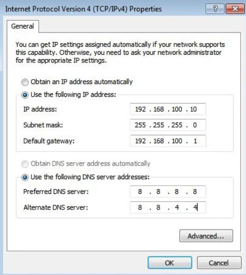
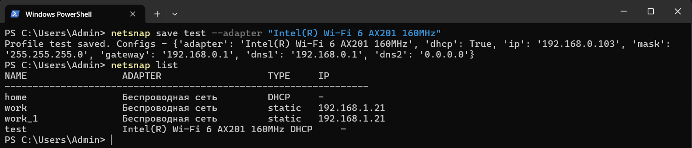

# netsnap


A lightweight CLI utility for quickly switching network configurations on Windows.
No GUI, no bloat — just one command.

## The Problem

If you work in industrial automation or frequently move between networks, you know the pain:

- At the office — static IP, custom gateway, corporate DNS
- At home — DHCP, everything automatic
- On-site connecting directly to a PLC — yet another static IP in a completely different subnet

Every time you switch, you have to dig through:
**Control Panel → Network Connections → Properties → IPv4 → Properties → type everything manually → OK**



That's 7 clicks and 30 seconds. Every. Single. Time.

## The Solution

Store your network configurations as named profiles in a JSON file.
Switch between them with one command from anywhere on your machine:

```powershell
netsnap apply work
netsnap apply home
netsnap apply plc_station1
```

## Requirements

- Windows 10/11
- Python 3.14
- [uv](https://github.com/astral-sh/uv) package manager
- Administrator privileges (required to change network settings)

## Installation

**1. Clone the repository:**
```powershell
git clone https://github.com/heavenyoung1/netsnap
cd netsnap
```

**2. Create virtual environment and install dependencies:**
```powershell
uv sync
```

**3. Install the `netsnap` command globally:**
```powershell
uv pip install -e .
```

**4. Create your profiles file from the template:**
```powershell
Copy-Item profiles.example.json profiles.json
```

Open `profiles.json` and fill in your actual network settings.

**5. Verify the installation:**
```powershell
netsnap list
```

## Usage

> ⚠️ Run PowerShell or CMD **as Administrator** when applying profiles.

```powershell
# Show all saved profiles
netsnap list

# Show current adapter configuration
netsnap show --adapter "Wi-Fi network"

# Apply a profile
netsnap apply home
netsnap apply work
netsnap apply plc_station1
```



## profiles.json

All profiles are stored in `profiles.json` next to the project files.
This file is **excluded from version control** — it contains real IP addresses.

Use `profiles.example.json` as a reference:

```json
{
  "home": {
    "name": "Wi-Fi network",
    "dhcp": true
  },
  "work": {
    "name": "Wi-Fi network",
    "adapter": "Intel(R) Wi-Fi 6 AX201 160MHz",
    "dhcp": false,
    "ip": "x.x.x.x",
    "mask": "255.255.255.0",
    "gateway": "x.x.x.x",
    "dns1": "x.x.x.x",
    "dns2": "x.x.x.x"
  },
  "plc_station1": {
    "name": "Ethernet",
    "adapter": "Intel(R) Ethernet Connection (16) I219-V",
    "dhcp": false,
    "ip": "192.168.1.100",
    "mask": "255.255.255.0",
    "gateway": "",
    "dns1": ""
  }
}
```

## Project Structure

```
netsnap/
├── main.py              # CLI entry point (argparse)
├── adapter_applier.py   # Applies profiles via netsh
├── adapter_wmi.py       # Reads current adapter state via WMI
├── profile_store.py     # Reads and writes profiles.json
├── logger.py            # Logging setup
├── profiles.json        # Your profiles (git-ignored)
├── profiles.example.json
└── pyproject.toml
```

## How It Works

```
netsnap apply work
       │
       ▼
profile_store.py        reads "work" profile from profiles.json
       │
       ▼
adapter_applier.py      runs netsh commands:
                        netsh interface ip set address name="Wi-Fi" static ...
                        netsh interface ip set dns name="Wi-Fi" static ...
       │
       ▼
Windows changes network settings  ✓
```

Reading current adapter state uses **WMI** (Windows Management Instrumentation) —
a built-in Windows interface that returns structured data directly,
without parsing text output.

Applying profiles uses **netsh** — the standard Windows network configuration tool.

## Dependencies

| Package | Purpose |
|---------|---------|
| `wmi` | Read current adapter configuration |
| `pywin32` | Required by wmi |

No external dependencies for applying profiles — only Python stdlib + system `netsh`.

## Ideas for Future Development

- `netsnap save work` — save current adapter settings as a profile
- `netsnap show` — display current settings of all adapters  
- Auto-switching by SSID — apply profile automatically when connecting to a known network
- Linux support via `nmcli`
- Tray icon for one-click switching

## Contributing

Contributions are welcome! Here's how to get started:

1. Fork the repository
2. Create a branch for your feature or fix: `git checkout -b my-feature`
3. Make your changes and commit them: `git commit -m "Add my feature"`
4. Push to your fork: `git push origin my-feature`
5. Open a Pull Request

If you have an idea but don't want to code it yourself, feel free to open an Issue — even a short description helps.

Please keep pull requests focused: one feature or fix per PR.